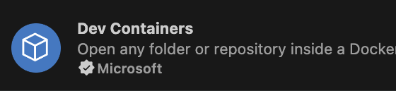
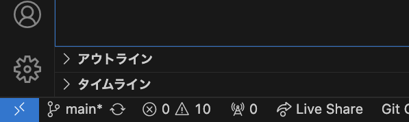

# PHPの学習を行えるリポジトリです

## 必要なもの
- [GitHub](https://github.com)
- [Docker](https://www.docker.com)
- [VSCode](https://code.visualstudio.com)
- [DevContainer](https://marketplace.visualstudio.com/items?itemName=ms-vscode-remote.remote-containers)

## 環境構築

1. git clone
```bash
git clone git@github.com:ryoweb/PHPTraining.git
```

2. インストールしたルートディレクトリに移動する
```bash
cd PHPTraining
```

3. dockerを起動する(*1)
```bash
docker compose up -d
```

4. 拡張機能からDevContainerをインストール


5. VSCode左下の><をクリックしてReopen in Containerを選択(日本語であればコンテナーで再度開くを選択)


6. localhost:8080/welcome/にアクセスし表示がされれば環境構築完了です
    
    [lolcahost:8080/welcome/](http://localhost:8080/welcome)

    [phpMyAdmin](http://localhost:18080/)

## 課題の進め方
trainingディレクトリ配下にあるstep1からstep10(仮)までのディレクトリに課題があります。

``stepXX/README.md``に課題の内容、進行方法が記載されていますので参考に学習を進めてください 

## ディレクトリ構成の解説
```
PHPTraining
├── README.md(環境構築手順)
├── .data(DBのデータ、compose up -dを実行すると作成されます)
├── .devcontainer(VSCodeのDevContainerの設定ファイル)
├── .docker(Dockerの設定ファイル)
├── .vscode(VSCodeの設定ファイル)
├── tests(テストケース)
├── vendor(ライブラリ、compose up -dを実行すると作成されます)
├── .gitignore(gitの管理対象にしないファイルを設定するファイル)
├── composer.json(ライブラリの設定ファイル)
├── composer.lock(ライブラリの設定ファイル)
├── docker-compose.yml(Dockerの設定ファイル)
├── training(課題を行うファイル)
│   ├── step1
│   │   ├── README.md
│   │   └── index.php
│   │
│   ├── step2
│   │   ├── README.md
│   │   └── index.php
│   │
...
```

### その他
#### *1 AppleSiliconの利用をしているとエラーが出る可能性があります。
docker-compose.ymlファイルに記述されているコメントアウトを外し、再度docker compose up -dを実行してみて下さい。
```yml
# platform: linux/x86_64
```